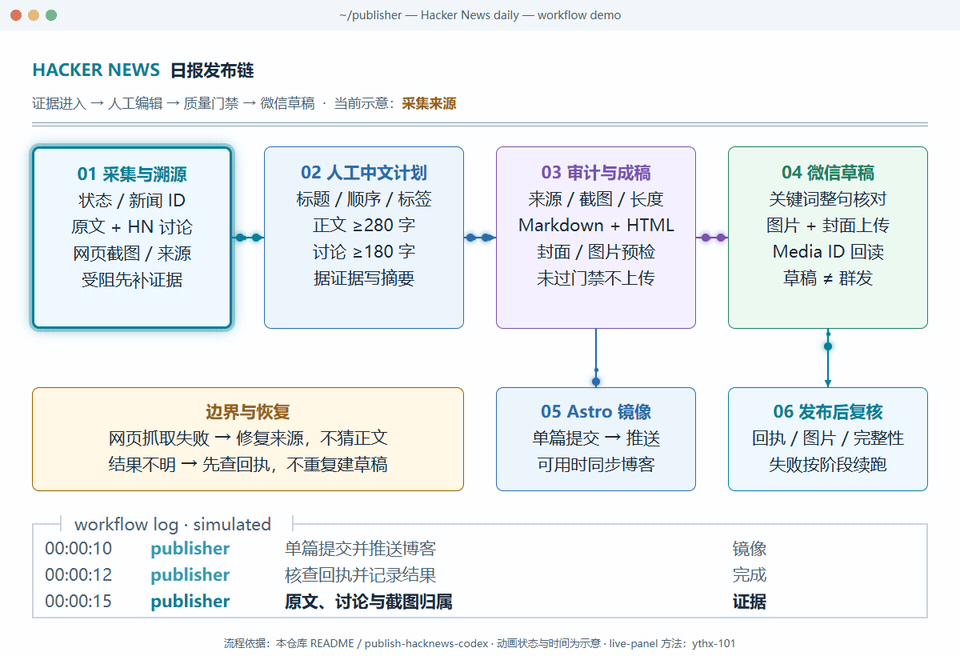

# 新闻与月榜发布器

本仓库提供 Hacker News 中文日报和 Product Hunt 中文月报的采集、编辑门禁与发布。两个业务模块共享一份微信发布实现，使用一个 Python 安装包和统一版本。默认“发布到微信”是创建公众号**草稿**，不是群发。

## 项目边界

| 位置 | 职责 |
| --- | --- |
| `publisher/` | 日报编排入口；Product Hunt 命令转交给 `ph2md`。 |
| `hn2md/`、`src/` | Hacker News 阶段、抓取、数据库和来源集成。 |
| `ph2md/` | 月榜抓取、Top 10 编辑审计、渲染、月度状态与发布回执。 |
| `publisher_shared/wechat/` | 公共 Markdown 转换、图片上传、公众号草稿创建与校验。 |
| `skills/publish-hacknews-codex/` | 日报的 Codex 编辑与恢复流程。 |
| `skills/publish-producthunt-monthly/` | 本仓库月报的编辑与发布流程。 |

Astro 博客是独立仓库。Hacker News 完整发布会尝试同步 Astro；Product Hunt 月报默认仅创建微信草稿。两个来源的数据库和发布回执不混用。组织方式与依赖边界见 [Monorepo 架构](docs/MONOREPO.md)。

## 安装与配置

需要 Python 3.11+；Windows 示例使用 PowerShell，Codex 用于人工计划和封面工作流。SQLite 由 Python 使用，不要求单独安装 `sqlite3` 命令行工具。

```powershell
python -m venv .venv
.\.venv\Scripts\python.exe -m pip install -e ".[hackernews,producthunt]"
Copy-Item .\config\config.json.example .\config\config.json
Copy-Item .\config\deployment.example.json .\config\deployment.local.json
powershell -ExecutionPolicy Bypass -File .\install.ps1
```

仅使用 Product Hunt 可将安装参数改为 `".[producthunt]"`；仅使用 Hacker News 用 `".[hackernews]"`。只下载这一个仓库即可，公共发布模块会一并安装。`requirements.txt` 保留完整依赖供旧安装方式使用。依赖详情以 `pyproject.toml` 为准。

`install.ps1` 安装本仓库的 Hacker News skill，是 Codex 工作流的可选步骤。把微信公众号 AppID/AppSecret 放在忽略的 `config/config.json`，也可使用 `WECHAT_APPID`、`WECHAT_APPSEC`；本机 Astro 路径等放在 `config/deployment.local.json`。PH 使用相同的本部署配置，无需部署另一个项目。不要提交凭据、`data/` 或 `output/`。

日报优先使用 `scripts/publisher.ps1`，月报优先使用 `scripts/ph2md.ps1`，包装器选择已配置的 Python 环境。安装后也可使用 `publisher`、`ph2md` 命令；跨平台月报入口是 `python -m ph2md.cli`。`hn2md` 是内部兼容 CLI；新的日报流程以 `publisher` 为准。

## Hacker News 日报

先检查当天状态：

```powershell
.\scripts\publisher.ps1 status hackernews
```

在 Codex 中请求“发布今天新闻”会进入 [日报技能](skills/publish-hacknews-codex/SKILL.md)的人工计划流程：获取新闻与正文、按来源保存视觉材料、逐条撰写并检查中文草稿；全部门禁通过后才排序、汇总、渲染和生成封面，再创建微信草稿、尝试 Astro 同步并复核。`check-story` 保存与来源和草稿版本绑定的单条回执，`story-status` 汇报剩余问题，`assemble-plan` 只汇总已通过条目；局部修改只重检查受影响的新闻。`release hackernews` 的自动计划不能替代这条编辑流程。未完成的运行按回执续跑，不重复创建已确认的草稿。

### 从 Hacker News 到微信草稿：九步流程

下面的白底动图展示日报从证据采集到微信草稿、Astro 镜像与发布后复核的完整链路；动画状态、时间和日志均为示意，并非实时发布监控。它使用 [live-panel-skill](https://github.com/ythx-101/live-panel-skill) 的配置式动态流程图方法制作，[配置文件](examples/hacknews-live-panel/config.json)留在仓库中。



下表展开微信草稿的九个检查点。可播放、暂停、调速和跳转步骤的[单文件交互演示](examples/hacknews-wechat-process.html)也可离线打开；这些演示不会运行命令或上传草稿。

| 阶段 | 步骤 | 产出与检查点 |
| --- | --- | --- |
| 采集与溯源 | 01 状态与选题 | 先查当日账本与回执，续跑未完成任务；新任务才取得有序新闻 ID。 |
| 采集与溯源 | 02 正文与讨论 | 收集原文和 HN 评论并分别归属；空正文、登录页或截断页不能当作完整来源。 |
| 采集与溯源 | 03 视觉材料与预审 | 普通网页保存来源截图；GitHub 页面保存分享预览图及正文图片，不抓重复截图。运行来源预审并修复缺失材料。 |
| 编辑与成稿 | 04 人工中文计划 | 根据证据撰写标题、正文摘要、HN 讨论摘要、四个标签与新闻顺序。 |
| 编辑与成稿 | 05 应用与严格审计 | 检查来源、截图和内容；正文摘要至少 280 字、讨论摘要至少 180 字，未批准阻断项不能放行。 |
| 编辑与成稿 | 06 渲染并核对 | 生成 Markdown 与微信 HTML，核对顺序、链接、段落和图片引用。 |
| 微信草稿 | 07 封面与本地预检 | 验收封面及宽图、方图裁剪；预检图文，但不调用微信上传。 |
| 微信草稿 | 08 关键词与发布核对 | 若有关键词提醒，核对完整句子；需要确认时记录决定，无提醒则不虚构审批。 |
| 微信草稿 | 09 创建草稿与回执 | 通过规范入口上传，取得 Media ID 并核对结果；草稿不是群发，结果不明时先查回执，不盲目重传。 |

这段演示只覆盖微信草稿。完整日报发布还会在可用时尝试 Astro 同步，并执行发布后复核。

需要恢复某个阶段或排查失败时，先看 [运行手册](docs/RUNBOOK.md)和技能里的条件性恢复指引。GitHub 页面用已保存的分享预览图替代截图；其他有源 URL 的新闻在微信上传前须有截图，除非用户对该条明确同意并记录一次性豁免。正文来源和摘要也有独立门禁。

当内容与封面已准备好、但当前网络不在微信 IP 白名单时，可在切换网络后运行桌面快捷方式或：

```powershell
python .\scripts\publish_today_wechat.py --check --no-pause
python .\scripts\publish_today_wechat.py --no-pause
```

这只读取台北时间当天已生成的文章和封面，并通过规范的 `publisher` 路径创建微信草稿，不生成正文或推送 Astro。`--check` 仅检查回执、文件和已知白名单失败；实际上传仍须通过 publisher 的发布审计。若上次被拒绝的出口 IP 未变化，它会在本地停下；同一 IP 已加入白名单时可显式加 `--whitelist-updated`。已有 Media ID 时不会重传。

## Product Hunt 月报

月报流程已纳入本仓库 `ph2md/`，要求 Top 10 的逐条观察、风险和图片，以及完整榜单和原月榜链接。使用 `scripts/ph2md.ps1` 运行完整编辑流程，旧基础榜单实现已由这条流程替代。详细步骤、迁移及恢复见 [Product Hunt 指南](docs/PRODUCTHUNT.md)，编辑标准见 [月报技能](skills/publish-producthunt-monthly/SKILL.md)。

以下以最近一个完整自然月 2026 年 9 月为例，已有该月数据时先复用，再按需要抓取：

```powershell
.\scripts\ph2md.ps1 status --year 2026 --month 9
.\scripts\ph2md.ps1 fetch --year 2026 --month 9 --limit 25
.\scripts\ph2md.ps1 export-plan --year 2026 --month 9
```

补完 `output/producthunt/codex/producthunt_plan_202609.json` 的产品观察与风险后：

```powershell
.\scripts\ph2md.ps1 audit --year 2026 --month 9
.\scripts\ph2md.ps1 render --year 2026 --month 9
.\scripts\ph2md.ps1 preview --year 2026 --month 9
# 需要创建微信草稿时执行
.\scripts\ph2md.ps1 publish --year 2026 --month 9
```

预检不调用微信 API。上传会记录 Media ID 和月报状态，已确认成功或结果不明的上传不会自动重复。PH 数据库为 `data/producthunt/producthunt.db`，产物和回执在 `output/producthunt/`；无需另行安装 HN 专用依赖。旧独立项目的数据先按指南显式迁移，保留原件和既有草稿 Media ID。

## 微信预检与验证

低层微信工具的 `--preview` 会转换 Markdown，检查正文、本地图片格式及 1 MB 自动上传限制、封面可读性和两种裁剪；它不调用微信接口，也不创建草稿。直接调用此工具不会替代日报/月报各自的来源与编辑门禁。见 [微信发布指南](docs/WECHAT_PUBLISH.md)。

针对改动运行相关测试；例如：

```powershell
pytest tests/test_publish_today_wechat.py tests/test_publish_wechat_preview.py -q --tb=short
```

发布规则的已接受取舍见 [决策记录](docs/DECISIONS.md)。
